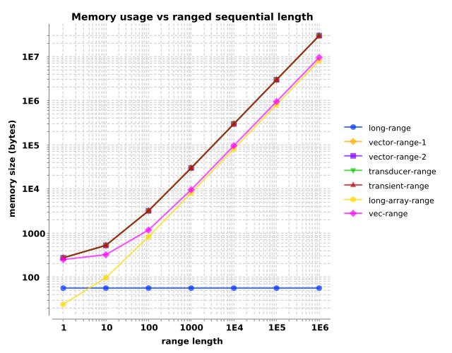
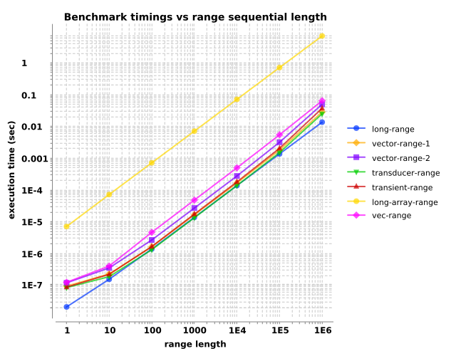

  <body>
    <h1>
      Memory and timing measurements of various range sequentials
    </h1>
    

      <h3>
        <em>What are the memory and processing trade-offs for different tactics of constructing a sequential of <code>1-n</code>?</em>
      </h3>
      

        We could merely guess, and the unpredictability of the JVM&apos;s dynamic optimizations and the non-determinism of the OS environment make it even more
        uncertain. So let&apos;s make some quick measurements.
      

      

        We will measure the memory size and processing times for constructing a sequential of integers of lengths one, ten, ..., one million. Let&apos;s
        consider seven <a href="https://github.com/blosavio/brokvolli/blob/main/test/brokvolli/performance/create_range.clj">tactics</a>.
      

      <ul>
        <li>
          

            <code>long-range</code> creates a <code>clojure.lang.LongRange</code>. The naive, base case.
          

        </li>
        <li>
          

            <code>vector-range-1</code> stuffs a <code>clojure.lang.LongRange</code> into a vector via <code>into</code>.
          

        </li>
        <li>
          

            <code>vector-range-2</code> calls <code>vec</code> on a <code>clojure.lang.LongRange</code>.
          

        </li>
        <li>
          

            <code>transducer-range</code> is a transducer variant of <code>into</code>, analogous to <code>vector-range-1</code>.
          

        </li>
        <li>
          

            <code>transient-range</code> conjoins onto a transient vector.
          

        </li>
        <li>
          

            <code>long-array-range</code> returns a Java array of longs constructed with <code>amap</code>.
          

        </li>
        <li>
          

            <code>vec-range</code> returns a primitive vector, i.e., an instance of <code>clojure.core.Vec</code>.
          

        </li>
      </ul>
      

        Don&apos;t read too much into the data, just get a sense for the general trends. Overall, long ranges, Java arrays of longs, and vectors-of-primitives
        are the most memory-efficient, while the transducer, transient, and range tactics are the most time efficient.
      

      

        A long-range seems to offer the best combination of memory efficiency and performance.
      

    

    

      <h2>
        Memory usage
      </h2>
      

        An instance of <code>clojure.lang.LongRange</code> is an <a href=
        "https://github.com/clojure/clojure/blob/master/src/jvm/clojure/lang/LongRange.java">efficient, special case</a>, which allows it consume a fixed,
        <a href="https://github.com/clojure-goes-fast/clj-memory-meter/issues/13">relatively-small</a> amount of memory.
      

      

        Beyond that, the Java long array and the Clojure primitive vector are the most space-efficient by about half an order of magnitude. All the variants
        that produce a vector are indistinguishable, as we should expect.
      

    

    <table>
      <caption>
        size in bytes
      </caption>
      <tr>
        <td></td>
        <th colspan="7">
          range length
        </th>
      </tr>
      <tr>
        <th>
          constructor
        </th>
        <th>
          1
        </th>
        <th>
          10
        </th>
        <th>
          100
        </th>
        <th>
          1000
        </th>
        <th>
          10000
        </th>
        <th>
          100000
        </th>
        <th>
          1000000
        </th>
      </tr>
      <tr>
        <td>
          long-range
        </td>
        <td>
          56
        </td>
        <td>
          56
        </td>
        <td>
          56
        </td>
        <td>
          56
        </td>
        <td>
          56
        </td>
        <td>
          56
        </td>
        <td>
          56
        </td>
      </tr>
      <tr>
        <td>
          vector-range-1
        </td>
        <td>
          272
        </td>
        <td>
          520
        </td>
        <td>
          3160
        </td>
        <td>
          29480
        </td>
        <td>
          294400
        </td>
        <td>
          2942336
        </td>
        <td>
          29419544
        </td>
      </tr>
      <tr>
        <td>
          vector-range-2
        </td>
        <td>
          272
        </td>
        <td>
          520
        </td>
        <td>
          3160
        </td>
        <td>
          29480
        </td>
        <td>
          294400
        </td>
        <td>
          2942336
        </td>
        <td>
          29419544
        </td>
      </tr>
      <tr>
        <td>
          transducer-range
        </td>
        <td>
          272
        </td>
        <td>
          520
        </td>
        <td>
          3160
        </td>
        <td>
          29480
        </td>
        <td>
          294400
        </td>
        <td>
          2942336
        </td>
        <td>
          29419544
        </td>
      </tr>
      <tr>
        <td>
          transient-range
        </td>
        <td>
          272
        </td>
        <td>
          520
        </td>
        <td>
          3160
        </td>
        <td>
          29480
        </td>
        <td>
          294400
        </td>
        <td>
          2942336
        </td>
        <td>
          29419544
        </td>
      </tr>
      <tr>
        <td>
          long-array-range
        </td>
        <td>
          24
        </td>
        <td>
          96
        </td>
        <td>
          816
        </td>
        <td>
          8016
        </td>
        <td>
          80016
        </td>
        <td>
          800016
        </td>
        <td>
          8000016
        </td>
      </tr>
      <tr>
        <td>
          vec-range
        </td>
        <td>
          248
        </td>
        <td>
          320
        </td>
        <td>
          1160
        </td>
        <td>
          9480
        </td>
        <td>
          94400
        </td>
        <td>
          942336
        </td>
        <td>
          9419544
        </td>
      </tr>
    </table>
    

      <h2>
        Benchmark timings
      </h2>
      

        Creating a <code>LongRange</code> appears to consistently be the fastest variant, closely followed by the transducer and transient variants. The Java
        array of longs is nearly two orders of magnitude slower.
      

    

    <table>
      <caption>
        times in seconds, <em>mean±std</em>
      </caption>
      <tr>
        <td></td>
        <th colspan="7">
          range length
        </th>
      </tr>
      <tr>
        <th>
          constructor
        </th>
        <th>
          1
        </th>
        <th>
          10
        </th>
        <th>
          100
        </th>
        <th>
          1000
        </th>
        <th>
          10000
        </th>
        <th>
          100000
        </th>
        <th>
          1000000
        </th>
      </tr>
      <tr>
        <td>
          long-range
        </td>
        <td>
          2.1e-08±2.9e-10
        </td>
        <td>
          1.5e-07±1.1e-09
        </td>
        <td>
          1.4e-06±1.1e-08
        </td>
        <td>
          1.4e-05±1.1e-07
        </td>
        <td>
          1.4e-04±2.1e-06
        </td>
        <td>
          1.4e-03±6.2e-06
        </td>
        <td>
          1.3e-02±5.9e-05
        </td>
      </tr>
      <tr>
        <td>
          vector-range-1
        </td>
        <td>
          9.3e-08±8.6e-10
        </td>
        <td>
          2.2e-07±3.7e-09
        </td>
        <td>
          1.6e-06±1.7e-08
        </td>
        <td>
          1.6e-05±2.6e-07
        </td>
        <td>
          1.6e-04±2.8e-06
        </td>
        <td>
          1.8e-03±6.3e-05
        </td>
        <td>
          2.8e-02±1.6e-02
        </td>
      </tr>
      <tr>
        <td>
          vector-range-2
        </td>
        <td>
          1.2e-07±8.0e-10
        </td>
        <td>
          3.5e-07±7.8e-10
        </td>
        <td>
          2.6e-06±6.2e-09
        </td>
        <td>
          2.7e-05±1.5e-07
        </td>
        <td>
          2.7e-04±7.5e-07
        </td>
        <td>
          3.1e-03±1.2e-04
        </td>
        <td>
          4.9e-02±2.4e-02
        </td>
      </tr>
      <tr>
        <td>
          transducer-range
        </td>
        <td>
          8.4e-08±7.9e-10
        </td>
        <td>
          1.8e-07±6.6e-10
        </td>
        <td>
          1.3e-06±1.8e-08
        </td>
        <td>
          1.3e-05±1.1e-07
        </td>
        <td>
          1.4e-04±1.5e-06
        </td>
        <td>
          1.5e-03±5.6e-05
        </td>
        <td>
          2.5e-02±1.4e-02
        </td>
      </tr>
      <tr>
        <td>
          transient-range
        </td>
        <td>
          8.7e-08±9.8e-10
        </td>
        <td>
          2.2e-07±1.7e-09
        </td>
        <td>
          1.6e-06±2.3e-08
        </td>
        <td>
          1.7e-05±4.3e-08
        </td>
        <td>
          1.8e-04±9.9e-07
        </td>
        <td>
          2.0e-03±6.2e-05
        </td>
        <td>
          3.7e-02±2.5e-02
        </td>
      </tr>
      <tr>
        <td>
          long-array-range
        </td>
        <td>
          7.0e-06±3.9e-08
        </td>
        <td>
          7.1e-05±1.3e-06
        </td>
        <td>
          7.1e-04±9.9e-06
        </td>
        <td>
          7.0e-03±1.4e-04
        </td>
        <td>
          7.0e-02±1.4e-03
        </td>
        <td>
          7.1e-01±8.3e-03
        </td>
        <td>
          7.0e+00±7.5e-02
        </td>
      </tr>
      <tr>
        <td>
          vec-range
        </td>
        <td>
          1.2e-07±1.3e-09
        </td>
        <td>
          4.0e-07±2.3e-09
        </td>
        <td>
          4.6e-06±1.4e-08
        </td>
        <td>
          4.8e-05±4.0e-07
        </td>
        <td>
          4.9e-04±7.9e-06
        </td>
        <td>
          5.4e-03±4.9e-05
        </td>
        <td>
          6.4e-02±5.1e-03
        </td>
      </tr>
    </table>
    

      <h2>
        Commentary
      </h2>
      

        Let&apos;s eye-ball the observations into coarse tiers.
      

      <table>
        <tr>
          <th>
            tier
          </th>
          <th>
            memory
          </th>
          <th>
            performance
          </th>
        </tr>
        <tr>
          <td>
            0
          </td>
          <td>
            

              <strong>long-range</strong>
            

          </td>
          <td></td>
        </tr>
        <tr>
          <td>
            1
          </td>
          <td>
            

              long-array-range 
              vec-range
            

          </td>
          <td>
            

              <strong>long-range</strong> 
              <strong>vector-range-1</strong> 
              <strong>transducer-range</strong> 
              <strong>transient-range</strong> 
            

          </td>
        </tr>
        <tr>
          <td>
            2
          </td>
          <td>
            

              <strong>vector-range-1</strong> &amp; 2 
              <strong>transducer-range</strong> 
              <strong>transient-range</strong>
            

          </td>
          <td>
            

              vector-range-2 
              vec-range
            

          </td>
        </tr>
        <tr>
          <td>
            3
          </td>
          <td></td>
          <td>
            long-array-range
          </td>
        </tr>
      </table>
      

        Instances of Clojure <code>LongRange</code>, vector ranges, and the transducer and transient variants demonstrate the best performance on these tests,
        while offering tolerable memory consumption.
      

      

        Opinion for this application: Consume additional memory (within reason) to gain speed.
      

      

        Additionally, an instance of <code>LongRange</code> has the happy trait that it requires no additional cleverness to implement; it&apos;s built-in and
        idiomatic.
      

    

    

      Copyright © 2024–2026 Brad Losavio. 
      Compiled by <a href="https://github.com/blosavio/readmoi">ReadMoi</a> on 2026 January 02 . 
      0daf0dc7-b80c-4abd-a5d9-41ce4bf5eccf
    

  </body>
</html>
