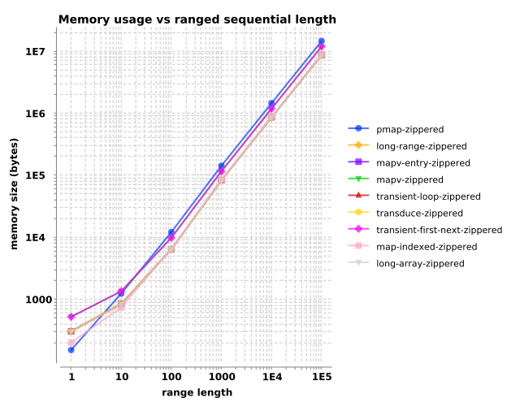
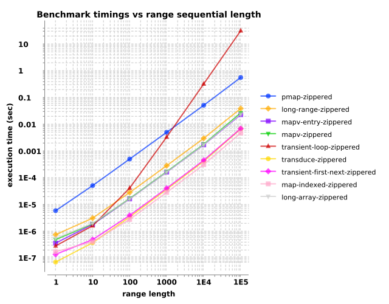

  <body>
    <h1>
      Memory and timing measurements of various zippers
    </h1>
    

      <h3>
        <em>What are the memory and processing trade-offs for different tactics of constructing a &apos;zippered&apos; structure of indexes and a vector&apos;s
        elements?</em>
      </h3>
      

        One strategy for implementing <code>transduce-kv</code> involves feeding a &apos;zippered&apos; thingy, a sequential consisting of 2-tuples of
        index+elements. For example, a vector like this...
      

      <pre><code>[97 98 99]</code></pre>
      

        ...gets &apos;zippered&apos; into this.
      

      <pre><code>[[0 97] [1 98] [2 99]</code></pre>
      

        Let&apos;s consider nine <a href="https://github.com/blosavio/brokvolli/blob/main/test/brokvolli/performance/create_zipped_sequential.clj">tactics</a>
        for generating such a zippered thing.
      

      <ul>
        <li>
          

            <code>mapv-zip</code> is the naive, base case, merely globbing an index onto each element and stuffing it into a two-element vector.
          

        </li>
        <li>
          

            <code>mapv-entry-zip</code> is similar, but investigates if using a <code>MapEntry</code> causes measurably different performance.
          

        </li>
        <li>
          

            <code>pmap-zip</code> is similar to the base case, but uses <code>pmap</code>.
          

        </li>
        <li>
          

            <code>long-range-zip</code> uses a primitive vector of <code>long</code>s to supply the indexes.
          

        </li>
        <li>
          

            <code>long-array-zip</code> uses a Java array of <code>long</code>s.
          

        </li>
        <li>
          

            <code>map-indexed-zip</code> uses the index supplied by <code>map-indexed</code>.
          

        </li>
        <li>
          

            <code>transduce-zip</code> transduces with <code>map-indexed</code>.
          

        </li>
        <li>
          

            <code>transient-loop-zip</code> conjoins onto a transient vector in a loop, avoiding creation of a secondary sequential to supply the indexes.
          

        </li>
        <li>
          

            <code>transient-first-next-zip</code> conjoins onto a transient vector using a recursive <code>first/next</code> idiom, avoiding creation of a
            secondary sequential.
          

        </li>
      </ul>
      

        From a high-level view, all tactics use a similar amount of memory. Performance-wise, the transducer, first/next transient, and map-indexed tactics
        provide the best performance.
      

    

    

      <h2>
        Memory usage
      </h2>
      

        All nine tactics consume memory within a factor of two or three. long-range zippers, mapv-entry zippers, transient and transducer zippers, and
        mapv-indexed zippers form a cluster of lower-tier memory usage, while pmap zippers, transient-first/next and mapv zippers comprise a higher-tier.
      

    

    <table>
      <caption>
        size in bytes
      </caption>
      <tr>
        <td></td>
        <th colspan="6">
          range length
        </th>
      </tr>
      <tr>
        <th>
          constructor
        </th>
        <th>
          1
        </th>
        <th>
          10
        </th>
        <th>
          100
        </th>
        <th>
          1000
        </th>
        <th>
          10000
        </th>
        <th>
          100000
        </th>
      </tr>
      <tr>
        <td>
          pmap-zippered
        </td>
        <td>
          152
        </td>
        <td>
          1232
        </td>
        <td>
          12032
        </td>
        <td>
          140960
        </td>
        <td>
          1436960
        </td>
        <td>
          14396960
        </td>
      </tr>
      <tr>
        <td>
          long-range-zippered
        </td>
        <td>
          304
        </td>
        <td>
          840
        </td>
        <td>
          6360
        </td>
        <td>
          82408
        </td>
        <td>
          851328
        </td>
        <td>
          8539264
        </td>
      </tr>
      <tr>
        <td>
          mapv-entry-zippered
        </td>
        <td>
          304
        </td>
        <td>
          840
        </td>
        <td>
          6360
        </td>
        <td>
          82408
        </td>
        <td>
          851328
        </td>
        <td>
          8539264
        </td>
      </tr>
      <tr>
        <td>
          mapv-zippered
        </td>
        <td>
          520
        </td>
        <td>
          1344
        </td>
        <td>
          9744
        </td>
        <td>
          114592
        </td>
        <td>
          1171512
        </td>
        <td>
          11739448
        </td>
      </tr>
      <tr>
        <td>
          transient-loop-zippered
        </td>
        <td>
          304
        </td>
        <td>
          840
        </td>
        <td>
          6360
        </td>
        <td>
          82408
        </td>
        <td>
          851328
        </td>
        <td>
          8539264
        </td>
      </tr>
      <tr>
        <td>
          transduce-zippered
        </td>
        <td>
          304
        </td>
        <td>
          840
        </td>
        <td>
          6360
        </td>
        <td>
          82408
        </td>
        <td>
          851328
        </td>
        <td>
          8539264
        </td>
      </tr>
      <tr>
        <td>
          transient-first-next-zippered
        </td>
        <td>
          520
        </td>
        <td>
          1344
        </td>
        <td>
          9744
        </td>
        <td>
          114592
        </td>
        <td>
          1171512
        </td>
        <td>
          11739448
        </td>
      </tr>
      <tr>
        <td>
          map-indexed-zippered
        </td>
        <td>
          200
        </td>
        <td>
          736
        </td>
        <td>
          6448
        </td>
        <td>
          84288
        </td>
        <td>
          869512
        </td>
        <td>
          8721960
        </td>
      </tr>
      <tr>
        <td>
          long-array-zippered
        </td>
        <td>
          304
        </td>
        <td>
          840
        </td>
        <td>
          6360
        </td>
        <td>
          82408
        </td>
        <td>
          851328
        </td>
        <td>
          8539264
        </td>
      </tr>
    </table>
    

      <h2>
        Benchmark timings
      </h2>
      

        The performance measurements could be grouped into roughly three tiers. The fastest tier contains transduce zippers, transient first/next zippers, and
        map-indexed zippers. pmap zippers perform consistently worse, and transient loop zippers show supra-exponential slow-downs on these tests..
      

    

    <table>
      <caption>
        times in seconds, <em>mean±std</em>
      </caption>
      <tr>
        <td></td>
        <th colspan="6">
          range length
        </th>
      </tr>
      <tr>
        <th>
          constructor
        </th>
        <th>
          1
        </th>
        <th>
          10
        </th>
        <th>
          100
        </th>
        <th>
          1000
        </th>
        <th>
          10000
        </th>
        <th>
          100000
        </th>
      </tr>
      <tr>
        <td>
          pmap-zippered
        </td>
        <td>
          5.9e-06±1.5e-08
        </td>
        <td>
          5.1e-05±8.8e-08
        </td>
        <td>
          5.0e-04±2.0e-06
        </td>
        <td>
          5.0e-03±3.6e-05
        </td>
        <td>
          5.1e-02±2.5e-04
        </td>
        <td>
          5.5e-01±8.8e-02
        </td>
      </tr>
      <tr>
        <td>
          long-range-zippered
        </td>
        <td>
          7.4e-07±1.4e-09
        </td>
        <td>
          3.1e-06±6.6e-09
        </td>
        <td>
          2.8e-05±1.4e-07
        </td>
        <td>
          2.8e-04±2.4e-06
        </td>
        <td>
          3.0e-03±9.3e-06
        </td>
        <td>
          3.9e-02±6.4e-03
        </td>
      </tr>
      <tr>
        <td>
          mapv-entry-zippered
        </td>
        <td>
          3.6e-07±1.8e-09
        </td>
        <td>
          1.8e-06±4.0e-09
        </td>
        <td>
          1.6e-05±4.0e-08
        </td>
        <td>
          1.6e-04±3.0e-07
        </td>
        <td>
          1.7e-03±6.0e-06
        </td>
        <td>
          2.3e-02±4.4e-03
        </td>
      </tr>
      <tr>
        <td>
          mapv-zippered
        </td>
        <td>
          4.9e-07±9.3e-09
        </td>
        <td>
          1.9e-06±1.8e-08
        </td>
        <td>
          1.7e-05±2.5e-07
        </td>
        <td>
          1.7e-04±3.4e-06
        </td>
        <td>
          1.8e-03±2.4e-05
        </td>
        <td>
          2.6e-02±7.8e-03
        </td>
      </tr>
      <tr>
        <td>
          transient-loop-zippered
        </td>
        <td>
          2.8e-07±1.0e-09
        </td>
        <td>
          1.6e-06±6.2e-09
        </td>
        <td>
          4.1e-05±1.2e-06
        </td>
        <td>
          3.3e-03±1.6e-05
        </td>
        <td>
          3.2e-01±3.6e-03
        </td>
        <td>
          3.1e+01±8.0e-01
        </td>
      </tr>
      <tr>
        <td>
          transduce-zippered
        </td>
        <td>
          7.0e-08±1.9e-10
        </td>
        <td>
          3.7e-07±8.3e-10
        </td>
        <td>
          3.4e-06±5.8e-09
        </td>
        <td>
          3.7e-05±4.5e-07
        </td>
        <td>
          4.1e-04±1.2e-06
        </td>
        <td>
          6.7e-03±1.8e-03
        </td>
      </tr>
      <tr>
        <td>
          transient-first-next-zippered
        </td>
        <td>
          1.4e-07±2.7e-09
        </td>
        <td>
          4.9e-07±7.5e-09
        </td>
        <td>
          3.9e-06±2.2e-08
        </td>
        <td>
          4.0e-05±3.5e-07
        </td>
        <td>
          4.5e-04±9.3e-06
        </td>
        <td>
          6.8e-03±2.4e-03
        </td>
      </tr>
      <tr>
        <td>
          map-indexed-zippered
        </td>
        <td>
          1.7e-07±3.2e-10
        </td>
        <td>
          4.0e-07±7.4e-10
        </td>
        <td>
          2.8e-06±5.4e-09
        </td>
        <td>
          2.8e-05±5.9e-08
        </td>
        <td>
          3.1e-04±9.1e-07
        </td>
        <td>
          4.7e-03±1.4e-03
        </td>
      </tr>
      <tr>
        <td>
          long-array-zippered
        </td>
        <td>
          5.4e-07±9.1e-10
        </td>
        <td>
          2.0e-06±4.5e-09
        </td>
        <td>
          1.6e-05±2.7e-08
        </td>
        <td>
          1.6e-04±3.3e-07
        </td>
        <td>
          1.7e-03±7.0e-06
        </td>
        <td>
          2.4e-02±4.6e-03
        </td>
      </tr>
    </table>
    

      <h2>
        Commentary
      </h2>
      

        Let&apos;s assemble a summary table.
      

      <table>
        <tr>
          <th>
            tier
          </th>
          <th>
            memory
          </th>
          <th>
            performance
          </th>
        </tr>
        <tr>
          <td>
            1
          </td>
          <td>
            

              long-range-zippered 
              mapv-entry-zippered 
              transient-loop-zippered 
              <strong>transduce-zippered</strong> 
              <strong>map-indexed-zippered</strong> 
              long-array-zippered
            

          </td>
          <td>
            

              <strong>transduce-zippered</strong> 
              <strong>map-indexed-zippered</strong> 
              <strong>transient-first-next-zippered</strong> 
            

          </td>
        </tr>
        <tr>
          <td>
            2
          </td>
          <td>
            

              pmap-zippered 
              mapv-zippered 
              <strong>transient-first-next-zippered</strong>
            

          </td>
          <td>
            

              mapv-entry-zippered 
              mapv-zippered 
              long-array-zippered 
              long-range-zippered
            

          </td>
        </tr>
        <tr>
          <td>
            3
          </td>
          <td></td>
          <td>
            

              transient-loop-zippered 
              pmap-zippered
            

          </td>
        </tr>
      </table>
      

        The transduce, transient-first/next, and map-indexed zipper variants demonstrate the fastest performance on these tests. The transduce variant and
        map-indexed provide a bit more memory efficiency than transient-first/next.
      

      

        The map-indexed tactic has the strong benefit that it requires no implementation cleverness; it&apos;s built-in and idiomatic.
      

    

    

      Copyright © 2024–2026 Brad Losavio. 
      Compiled by <a href="https://github.com/blosavio/readmoi">ReadMoi</a> on 2026 January 02 . 
      e378c649-434d-4237-a25d-cbdc0759e798
    

  </body>
</html>
